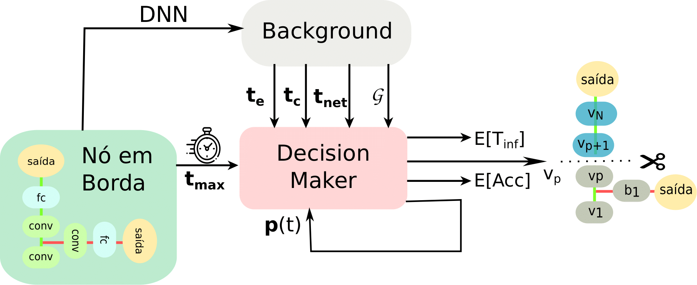

# POPEX (Partitioning OPtimization Early eXit network)

This project proposes POPEX, an early exit network partitioning system. In a broader view, POPEX aims to accelerate the inference time, reducing not only communication delay though DNN partitioning, but also reducing the processing delay using early exit networks (e.g. BranchyNet). Therefore, this project aims to allow latency-sensitivity applications, such as smart car and cognitive assistance. To this end, POPEX splits an early exit network into two parts, so that one is processed at the edge device (e.g. smartphone, wearables, and laptops), while the other part is processed at the cloud server. 

# Architecture
This project is divided into two main components: Background and Decision Maker. The architecture of the system is shown below. 

The Background component is responsible for monitoring the uplink rate of the network infrastructure between the edge device and the cloud server, and also for extracting the optimization parameters. The Decision Maker executes the adaptive partitioning, according to the optimization parameters and uplink rate extracted by the Background component. The adaptive partitioning consists of selecting an optimal partitioning, that maximizes the classification accuracy while also achieves a pre-defined user latency requirement. 

First of all, the application provides two pieces of information to the POPEX system: latency requirement and the employed BranchyNet architecture. The latter is inserted in the Background component, while the former is inserted at the Decision Maker to execute adaptive partitioning. The latency requirement refers to the maximum inference time allowed to classify an input sample.
The edge node, in Figure above, corresponds to a generic edge device such as a smartphone, wearable, or even an access point.  

Each component of this project is executed is explained in detail throughout the next sections.

## Background

Once the Background has received latency requirement and BranchyNet architecture from an application, the Background component extracts the parameters that are executed by the Decision Maker component. Background executes three tasks: extraction of static parameters, uplink rate monitoring, and construction of a graph related to BranchyNet architecture provided by the application in the edge node. In the first task, the Background extracts the processing time and output data size of each layer from BranchyNet. These parameters are specific to Branchynet architecture and processing power of edge device, thus these parameters are static, which means that it is necessary to be executed only once during the system boot.  

Besides that, the Background also monitors the uplink rate between the edge device and the cloud server. To this end, Background uses a ping tool and storage of the uplink rate. Then, Background can calculate the communication delay required to send output data of each layer, using uplink rate and output data size. Background monitors the uplink rate continuously, using the ping tool and storage this data for a period of time. 

Finally, the third task consists of constructing a graph based on BranchyNet architecture, where each layer corresponds to a vertex, and communication between layers represents the links in this graph. Therefore, POPEX converts a BranchyNet partitioning problem into a graph partitioning problem.  

## Decision Maker

The component Decision Maker is responsible to select, dynamically, the optimal partitioning layer, using the parameters provided by the Background. Therefore, Decision Maker is able to determine which BranchyNet layers are processed at the edge device or at the cloud server. The Decision maker is divided into four tasks: (1) estimation of inference time in BranchyNet; (2) optimization problem; (3) generation of multiples partitioning strategies; (4) decision of partitioning strategy. It is important to notice that, the first three tasks are executed, periodically, while the fourth is executed continually in the inference process, in other words, it is executed whenever edge receives input data. 

At first, Decision Maker receives parameters of processing time at the edge and at the cloud, in addition to the graph associated with BranchyNet architecture and the current communication time from Background. Then, Decision Makes constructs a new graph to convert the partitioning graph problem into a shortest path problem. Once constructed this new graph, we assign the weights in the links os this graph. As BranchyNet allows input samples to be classified at side branch, the weights assigned to the links are related to a probability of classifying a sample in a given side branch. This step in presented in detail [here](https://arxiv.org/pdf/2005.04099.pdf). At this stage, Decision Maker can execute the optimization problem to select the optimal partitioning that minimizes the inference time, using Dijkstra's algorithm. However, this partitioning decision depends on several parameters, including the hyperparameters of the BranchyNet such as the threshold associated with each side branch. This threshold configuration decides whether an input sample can be classified at the side branch or must be processed by the next layers. The choice of threshold configurations handles to a trade-off between classification accuracy and inference time.  
For example, when the entropy threshold of the first side branch is set to high values, such as 0.9, the first side branch can classify poorly confident samples, decreasing accuracy and inference time. Otherwise, when the entropy threshold of this side branch is set to low values, such as 0.1, only high confident input data can be classified at the first side branch, increasing accuracy and also inference time since the majority of samples requires to be processed by the next layers. 
After that, we vary the entropy threshold of side branches and choose the partitioning strategy using the optimization method described in [here](https://arxiv.org/pdf/2005.04099.pdf), which minimizes the inference time. 
Each entropy threshold configuration results in a different partitioning strategy with a specific pair of classification accuracy and inference time associated. At this stage, for a given uplink rate, there are multiples partitioning strategy stored for each threshold configuration with a unique pair of accuracy and inference time
This step is also executed only once during system boot. At this point, finally, Decision Maker can execute the decision task, whose goal is to select the partitioning strategy that maximizes the accuracy, while meets the pre-defined inference time provided by the application. 

This repository containing the code to reproduce results found in "Inference Time Optimization Using BranchyNet Partitioning" paper. If you want to use this codebase, please cite:

    @article{pacheco2020inference,
        title={Inference Time Optimization Using BranchyNet Partitioning},
        author={Pacheco, Roberto G and Couto, Rodrigo S},
        journal={arXiv preprint arXiv:2005.04099},
        year={2020}
    }

## Deployment 
POPEX is deployed using an edge computing infrastructure. This project deploys a Web API on edge device and cloud server using the Flask framework. The edge node has a Web API to receive the BranchyNet architecture from an application and to receive images from the end devices. When the application provides the BranchyNet, POPEX can execute the parameter extraction. Then, the edge devices receive an image from the end device, POPEX can select the partitioning decision based on extracted parameters by Background. Once the partitioning strategy is chosen, the edge device sends to the cloud the chosen partitioning layer and the output data from the partitioning layer. 

## Requirements
* Python 3.0+
* pytorch
* matplotlib
* pandas
* scipy
* Flask

